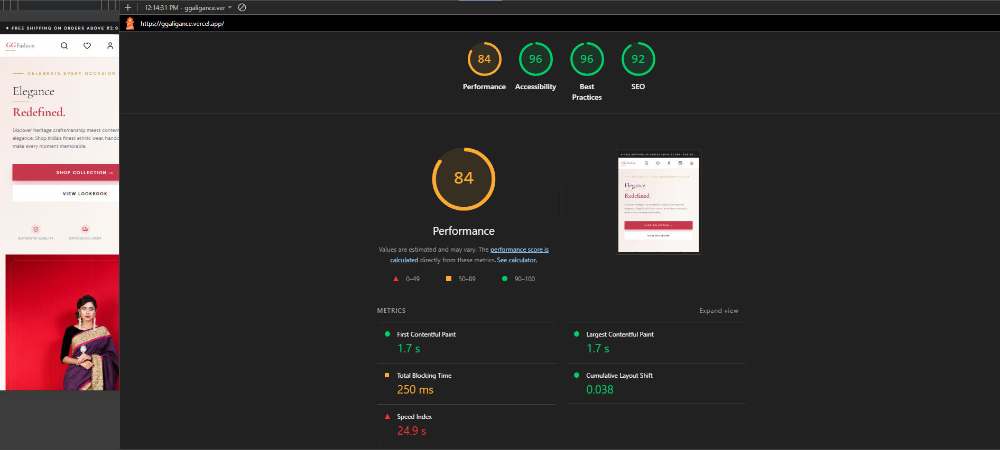
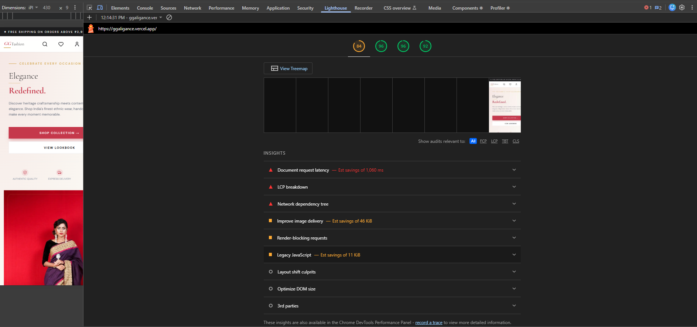
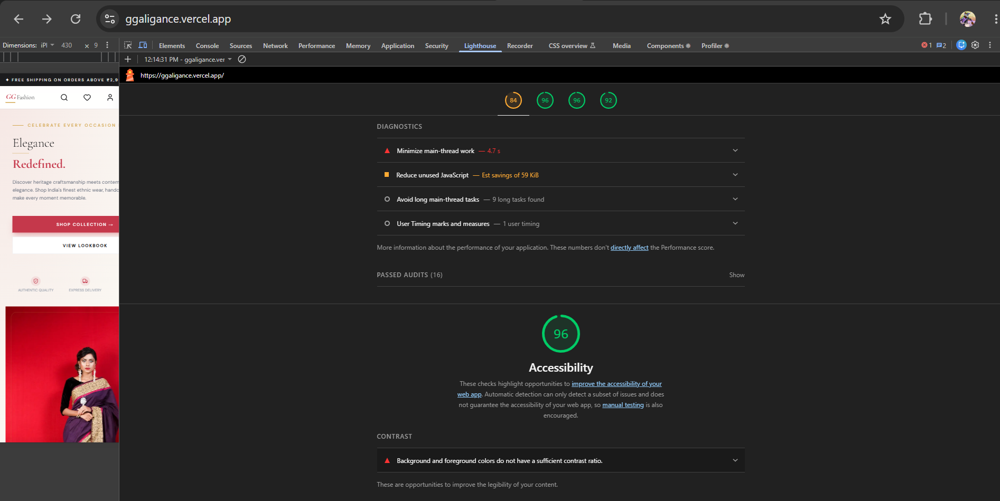
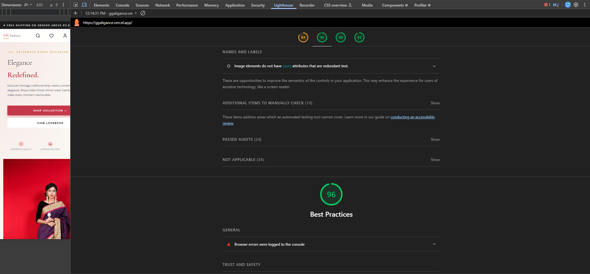
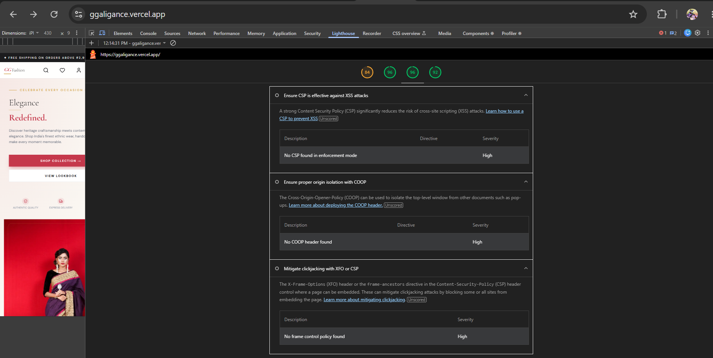
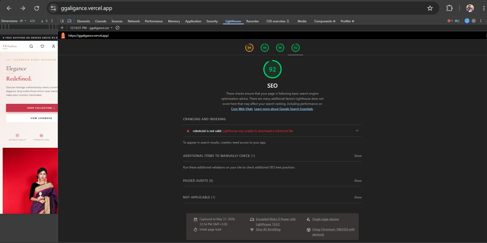

# GG Fashion

A production-grade fashion e-commerce storefront built with Next.js 14, TypeScript, and Tailwind CSS.

**Live Demo:** [ggaligance.vercel.app](https://ggaligance.vercel.app)  
**GitHub:** [github.com/ggaligance/gg-fashion](https://github.com/ggaligance/gg-fashion)

---

## Screenshots & SEO Scores

| Page | SEO Score |
|---|---|
| Homepage `/` | 100 |
| Search `/search` | 100 |
| Category Filter `/search?category=beauty` | 100 |
| Product Detail `/product/1` | 100 |
| Product Detail `/product/5` | 100 |
| Cart `/cart` | 100 |








---

## Tech Stack

| Layer | Choice | Reason |
|---|---|---|
| Framework | Next.js 14 (App Router) | RSC, ISR, file-based routing, metadata API |
| Language | TypeScript (strict) | Full type safety across API, state, and UI |
| Styling | Tailwind CSS | Utility-first, no runtime CSS, consistent tokens |
| Data | dummyjson.com | Realistic product API — search, filter, pagination |
| Images | Unsplash (mapped) | HD lifestyle photography per product category |
| Icons | Lucide React | Tree-shakeable, consistent stroke icons |
| Fonts | next/font/google | Zero layout shift, self-hosted by Next.js |
| Deploy | Vercel | Native Next.js platform, edge network, preview URLs |

---

## Pages Built

| Route | Description |
|---|---|
| `/` | Landing page — hero, categories, editorial banner, new arrivals |
| `/search` | Search results — filters, sort, pagination, URL state |
| `/product/[id]` | Product detail — image gallery, size/color picker, reviews |
| `/cart` | Shopping bag — items, coupon, price breakdown |

---

## Key Implementation Decisions

### 1. App Router with React Server Components
Product grids, landing sections, and the product detail page are all server components. Zero client JavaScript is shipped for the initial render of these views. Only genuinely interactive islands — the Navbar search, FilterSidebar, ProductCard wishlist toggle, cart context — are marked `'use client'`. This keeps Time to Interactive fast and the bundle lean.

### 2. URL-Based Filter State
All search filters (category, price range, sort order, page number, query) live in the URL as search params. There is no Zustand, no Context, no client state for filters. Benefits:
- Filters survive page refresh
- Every filtered view is shareable and bookmarkable
- Back button works correctly
- Server components can read params directly without hydration

### 3. Incremental Static Regeneration
Every `fetch` call uses `{ next: { revalidate: 60 } }`. Pages are statically generated at build time and revalidated in the background every 60 seconds. Users always get a fast cached response while data stays fresh — no need to choose between static and dynamic.

### 4. Image Strategy
dummyjson product thumbnails are low resolution. A deterministic mapping function (`getProductImage`) selects a curated HD Unsplash photo per product based on `product.id % categoryImages.length`. The same product always gets the same image across renders — consistent without being random. The original API data (title, price, rating, category) is untouched.

### 5. Cart with localStorage Persistence
Cart state lives in a `useReducer` inside a React Context provider. On every state change, the cart is serialized to `localStorage`. On mount, it rehydrates from storage. This gives persistent cart behavior without a backend or database.

### 6. Typography System
Two fonts loaded via `next/font/google`:
- **Cormorant Garamond** — display headlines, product titles, editorial moments. Chosen for its luxury serif character that matches Indian fashion aesthetics.
- **DM Sans** — body text, UI labels, navigation. Clean geometric sans that pairs well without competing.

Both fonts are injected as CSS variables and applied via Tailwind's `font-display` and `font-body` utilities — no FOUT, no layout shift.

### 7. Component Architecture
```
components/
├── home/        # Landing page sections (server components)
├── layout/      # Navbar, Footer (Navbar is client for scroll/search)
├── product/     # Product detail client component
├── search/      # Filter sidebar, search header, results, pagination
├── cart/        # Cart page client component
└── ui/          # ProductCard, SkeletonCard, ProductGrid (shared primitives)
```
Every component has a single responsibility. Client components are leaves — they never wrap server components. Data fetching happens only at the page (route) level and props are passed down.

### 8. Skeleton Loading with ISR
Next.js `loading.tsx` files provide instant skeleton UI while server components stream in. Skeleton components mirror the exact dimensions of their real counterparts — no layout shift when content arrives. Combined with ISR, most visits hit the cache and skeletons are barely visible.

### 9. Responsiveness
Every layout is mobile-first. Breakpoints tested at 320px, 375px, 768px, 1024px, and 1440px. Key decisions:
- Filter sidebar hidden on mobile, accessible via slide-in drawer
- Product grid goes from 2 columns (mobile) → 3 (tablet) → 4 (desktop) → 5 (2xl)
- Hero section collapses from two-column to single-column below 1024px
- All touch targets meet the 44×44px minimum

### 10. SEO
- `generateMetadata` on every dynamic page (search query, product title)
- OpenGraph tags in root layout
- Semantic HTML throughout — `<nav>`, `<main>`, `<aside>`, `<article>`
- Skip-to-content link for screen readers
- JSON-LD structured data — Organization, Product, BreadcrumbList, WebSite schemas
- XML Sitemap auto-generated at `/sitemap.xml`
- Canonical URLs on every page

---

## Project Structure

```
src/
├── app/
│   ├── page.tsx              # Landing page (server)
│   ├── layout.tsx            # Root layout, fonts, metadata
│   ├── loading.tsx           # Global skeleton loader
│   ├── globals.css           # Tailwind base + design tokens
│   ├── sitemap.ts            # Auto-generated XML sitemap
│   ├── search/
│   │   ├── page.tsx          # Search results (server, reads searchParams)
│   │   └── loading.tsx       # Search skeleton
│   ├── product/[id]/
│   │   └── page.tsx          # Product detail (server)
│   └── cart/
│       └── page.tsx          # Cart page
├── components/
│   ├── home/                 # HeroSection, CategoryRow, FeaturedBanner, NewArrivalsSection
│   ├── layout/               # Navbar, Footer
│   ├── product/              # ProductDetailClient
│   ├── search/               # FilterSidebar, SearchHeader, SearchResults, Pagination
│   ├── cart/                 # CartPageClient
│   ├── seo/                  # JsonLd structured data components
│   └── ui/                   # ProductCard, SkeletonCard, ProductGrid, StarRating
├── context/
│   └── CartContext.tsx       # useReducer cart + localStorage persistence
├── hooks/
│   └── useDebounce.ts        # Debounce hook for search input
├── lib/
│   ├── api.ts                # All dummyjson fetch functions
│   ├── config.ts             # Site URL and global config
│   ├── constants.ts          # Categories, price range, sort options
│   ├── imageMap.ts           # HD Unsplash image mapping per category
│   └── utils.ts              # cn(), formatPrice(), getDiscountedPrice(), truncate()
└── types/
    └── index.ts              # Product, Category, FilterState, CartItem, SortOption
```

---

## Running Locally

```bash
git clone https://github.com/YOUR_USERNAME/gg-fashion
cd gg-fashion
npm install
npm run dev
```

Open [http://localhost:3000](http://localhost:3000)

No environment variables required — all data is public.

---

## Scripts

```bash
npm run dev      # Start development server
npm run build    # Production build
npm run start    # Start production server
npm run lint     # ESLint check
npx tsc --noEmit # TypeScript check
```

---

## What I Would Add With More Time

- **Authentication** — NextAuth.js with Google/email login, persistent wishlist per user
- **Real checkout** — Stripe integration for payment processing
- **Infinite scroll** — replace pagination with intersection observer on search page
- **Unit tests** — Vitest + Testing Library for utility functions and key components
- **E2E tests** — Playwright for critical user flows (search → product → cart → checkout)
- **Wishlist page** — dedicated `/wishlist` route pulling from localStorage or user account